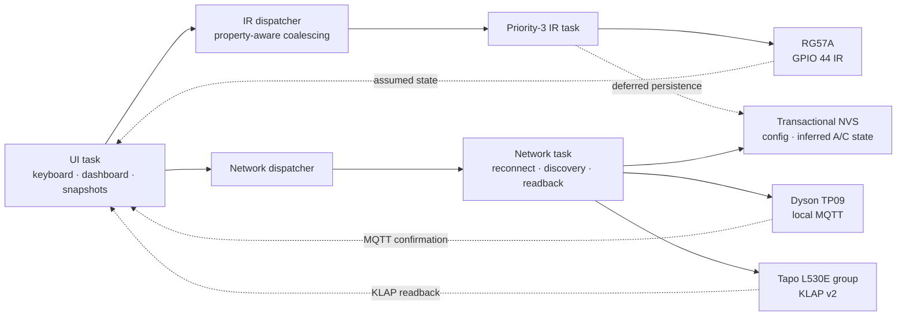

<div align="center">

# Cardputer Home Controller

**A local-first smart-home controller for Cardputer Adv — no Home Assistant, no runtime cloud, no fixed device IPs.**

[](VERSION)
[](LICENSE)


English · [繁體中文](README.zh-TW.md)

[Getting started](#quick-start) · [Architecture](#architecture) · [Support](SUPPORT.md) · [Contributing](CONTRIBUTING.md) · [Security](SECURITY.md) · [Changelog](CHANGELOG.md)

</div>

Cardputer Home Controller turns an M5Stack Cardputer Adv into a standalone LAN appliance remote. It controls a Taiwan Sanyo RG57A air conditioner over infrared, a Dyson TP09 over local MQTT, and every discovered Tapo L530E bulb over KLAP v2.

Normal operation stays entirely inside the local IPv4 network. The firmware does not require Home Assistant, an external server, a daily cloud connection, or manually assigned device IP addresses.

> [!NOTE]
> The current release is `1.0.0-rc3`. It has passed the automated firmware and Python suites and has been exercised on the target devices. The RG57A state remains inferred because infrared provides no readback.

## Highlights

- **Local by design** — direct IR, MQTT, and KLAP control without a runtime cloud dependency.
- **Automatic discovery** — Tapo bulbs use UDP discovery; TP09 uses `_dyson_mqtt._tcp` mDNS.
- **Whole-home lighting control** — one command targets every online L530E and reports partial success accurately.
- **Responsive infrared** — a dedicated priority-3 FreeRTOS task isolates IR from Tapo HTTP polling and Dyson reconnects; the latency target is 50 ms.
- **SaaS-inspired embedded UI** — dark card dashboard, device detail pages, live status, air-quality metrics, diagnostics, and battery/charging display.
- **Motion-aware power saving** — the display dims after 30 seconds, sleeps after 120 seconds, and wakes through the onboard BMI270 IMU.
- **Readback-aware commands** — Dyson waits for MQTT state and Tapo waits for KLAP readback for up to three seconds; IR is explicitly labelled as assumed state.
- **Transactional configuration** — two checksummed NVS slots preserve the previous valid configuration and migrate schema 1/2 data.

## Supported hardware

| Device | Transport | Coverage | Important behavior |
| --- | --- | --- | --- |
| M5Stack Cardputer Adv | ESP32-S3 | Display, keyboard, battery, BMI270, GPIO 44 IR | Target controller |
| Taiwan Sanyo RG57A A/C | Midea 48-bit IR | Power, 17–30 °C, Auto/Cool/Dry/Fan, fan speed, swing, Sleep, Turbo, Eco, Clean, LED, timers | State is last-sent/inferred; heating and Follow Me are disabled |
| Dyson TP09 (`438K`) | Local MQTT | Power, speed, auto, oscillation and angles, airflow direction, night mode, continuous monitoring, sleep timer, sensors and filter life | MyDyson is used only once to obtain the local credential |
| Tapo L530E | KLAP v2 | Group power, brightness, 2500–6500 K, HSV, effects and presets | Commands target the online set captured at send time |

## Architecture



The UI reads mutex-protected snapshots only. Blocking LAN operations cannot delay infrared transmission, and command completion is never inferred from queue acceptance alone.

## Repository layout

```text
.
├── firmware/                 Arduino/PlatformIO firmware
│   ├── include/              adapters, models and core policies
│   ├── src/                  UI, setup portal and device adapters
│   └── test/test_core/       native C++ tests
├── src/cardputer_probe/      Python LAN capability probe
├── tests/                    Python unit and simulated-device tests
├── docs/                     hardware acceptance and RG57A mapping
├── scripts/                  reproducible setup and build scripts
├── probe.py                  probe entry point
├── LICENSE                   MIT License for original project source
├── THIRD_PARTY.md            third-party sources and license notes
└── VERSION                   firmware release version
```

## Prerequisites

- Windows 10/11 with PowerShell
- Python 3.11 or newer; Python 3.12 is recommended
- Cardputer Adv, TP09, and L530E devices on the same IPv4 LAN
- UDP broadcast and mDNS allowed between the controller and devices
- L530E already provisioned with the Tapo app
- TP09 already linked to MyDyson for the one-time local credential bootstrap

## Quick start

### 1. Create the local environment

```powershell
Set-ExecutionPolicy -Scope Process Bypass
.\scripts\setup.ps1
```

The script creates `.venv`, installs pinned Python dependencies, and runs the Python test suite. Secrets and generated reports are excluded from Git.

### 2. Probe the real devices

Start with a read-only LAN probe:

```powershell
.\.venv\Scripts\python.exe .\probe.py all
```

Then run the reversible write/readback gate. Device state is snapshotted and restored on both success and failure paths:

```powershell
.\.venv\Scripts\python.exe .\probe.py all --write-test --save-dyson-credential
```

Generated local files:

- `probe-report.json` — redacted and safe to share after review.
- `.secrets/dyson-local.json` — contains the TP09 local MQTT credential; never share or commit it.

If discovery is blocked by the router, the probe accepts `--tapo-host` and `--dyson-host` overrides. Firmware operation itself continues to use automatic discovery.

### 3. Build firmware and run native tests

```powershell
.\.venv\Scripts\python.exe -m pip install -r .\firmware\requirements.txt
.\scripts\build-firmware.ps1 -RunNativeTests
```

The build script handles non-ASCII Windows paths through a temporary drive mapping and produces:

| Artifact | Flash offset | Purpose |
| --- | ---: | --- |
| `firmware/build/cardputer-home-controller-app.bin` | `0x10000` | Update while preserving NVS settings |
| `firmware/build/cardputer-home-controller-complete.bin` | `0x0` | Complete first-install image |
| `firmware/build/cardputer-home-controller-app-previous.bin` | `0x10000` | Rollback application |
| `firmware/build/firmware-manifest.json` | — | Version, size, offset, SHA-256 and validation state |

To build and upload the application through PlatformIO:

```powershell
.\.venv\Scripts\pio.exe run -d .\firmware -t upload --upload-port COM3
```

Replace `COM3` with the Cardputer port shown by Windows Device Manager.

## First-time setup

An unconfigured controller enters setup automatically. To re-enter setup later, hold the physical `Esc/\`` key throughout the five-second boot check.

1. Read the random WPA2 password on the Cardputer display.
2. Join the `Cardputer-Home-Setup` access point.
3. Open `http://192.168.4.1`.
4. Enter home Wi-Fi, Tapo credentials, and TP09 serial/product type/local MQTT credential.
5. Wait for L530E KLAP and TP09 MQTT validation to pass.

No device IP field is required. Settings are committed to NVS only after validation succeeds. The setup AP closes after completion or after its ten-minute timeout.

## Controls

### Global dashboard shortcuts

| Device | Keys |
| --- | --- |
| A/C | `Q` power · `W`/`E` temperature −/+ · `R` next mode |
| Dyson | `A` power · `S`/`D` speed −/+ · `F` oscillation · `G`/`H` shift angle |
| All Tapo bulbs | `Z` power · `X` warm/cool white · `C`/`V` brightness −/+ |

### Navigation

| Key | Action |
| --- | --- |
| `0` | Return to the global dashboard |
| `1` / `2` / `3` | Open A/C, Dyson, or lights |
| `4` | Open Dyson air-quality metrics |
| `I` | Open redacted diagnostics |
| `Tab` | Cycle pages |
| `W` / `S` | Move selection |
| `A` / `D` | Adjust selected value |
| `Enter` | Apply or toggle selected item |
| `Space` | Toggle power on the current device page |

Command icons are `…` pending, `✓` confirmed, `△` partially confirmed, and `!` failed/offline. A mixed light group turns fully off with one power command; rapid presses use the newest pending target rather than a stale snapshot.

## Diagnostics and power behavior

- Battery percentage and charging state appear in every page header.
- The diagnostics page shows Wi-Fi/IP, device counts, IMU status, heap, uptime, and last/max IR dispatch latency.
- Serial output reports IR latency as `ir dispatch ... latency_ms=... target_ms=50`; values above target include `WARNING`.
- The first key pressed while dimmed or sleeping wakes the screen and is consumed, preventing accidental appliance control.
- Display sleep is intentionally not ESP32 deep sleep: MQTT and LAN control remain available.

## Testing

```powershell
# Python unit and simulated-device tests
.\.venv\Scripts\python.exe -m pytest -q

# Firmware build plus native C++ tests
.\scripts\build-firmware.ps1 -RunNativeTests
```

Current automated baseline:

- 19 Python tests
- 14 native C++ tests
- PlatformIO release build with `-Wall`, `-Wextra`, `-Wswitch`, and `-Werror=return-type`
- Fixed vectors for Midea payloads, KLAP integrity/padding, command coalescing, retry timing, wrap-safe clocks, mixed-light power, motion wake, and isolated IR dispatch

Real-hardware procedures are maintained in [docs/hardware-acceptance.md](docs/hardware-acceptance.md).

## Security and privacy

- MyDyson email/password/OTP are used only by the local Python bootstrap and never copied into firmware.
- Normal control has no cloud fallback and exposes no remote Web API.
- Credentials are masked from reports and logs; `.secrets/` and `probe-report.json` are ignored by Git.
- Firmware stores Wi-Fi and device credentials in ordinary NVS. Flash/NVS encryption is not enabled, so physical flash access remains a known risk.
- The setup portal sends `no-store`, validates field formats and lengths, uses a random WPA2 password, and closes after completion or timeout.

If you discover a vulnerability, avoid publishing credentials, serial numbers, LAN addresses, or exploit details in a public issue. Contact the repository owner privately first.

## Known boundaries

- RG57A has no receive path. Using the original remote can desynchronize the displayed inferred state.
- Heating and Follow Me are intentionally disabled for the currently verified RG57A setup.
- Devices must share a reachable IPv4 LAN; cross-VLAN operation is not supported.
- Home Assistant discovery, scenes, schedules, OTA, a remote API, and daily cloud control are intentionally out of scope.
- TP09 cloud access is needed only during initial credential acquisition.

## Contributing

Issues and focused pull requests are welcome. Before submitting a change:

1. Do not commit `.secrets/`, reports containing private data, or device credentials.
2. Keep device protocols local-only and preserve automatic discovery.
3. Add native tests for protocol, queue, state, or timing changes.
4. Run both Python and firmware test commands.
5. Update the hardware acceptance checklist when behavior changes.

Useful references: [firmware guide](firmware/README.md), [hardware acceptance](docs/hardware-acceptance.md), [RG57A mapping](docs/rg57a-mapping.md), [support](SUPPORT.md), [security](SECURITY.md), [code of conduct](CODE_OF_CONDUCT.md), and [third-party notices](THIRD_PARTY.md).

## Licensing

Original project source is licensed under the [MIT License](LICENSE), Copyright (c) 2026 zx90316. Third-party components retain their respective licenses; see [THIRD_PARTY.md](THIRD_PARTY.md) before redistributing source or firmware binaries.

---

Built for reliable, private appliance control on the network you already own.
