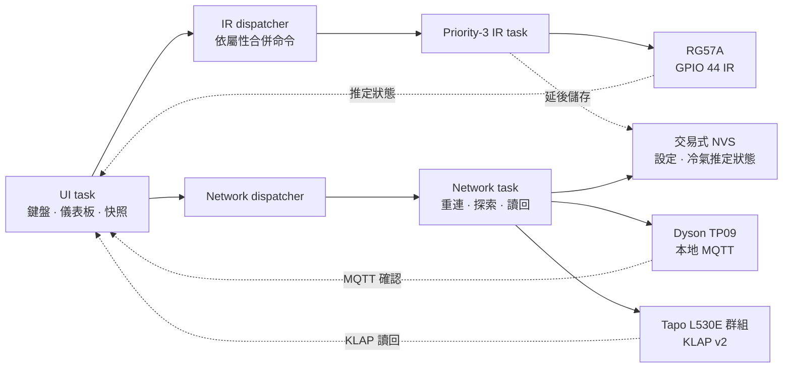

<div align="center">

# Cardputer Home Controller

**以 Cardputer Adv 打造的本地優先智慧家庭控制器——不需要 Home Assistant、日常雲端或固定設備 IP。**

[](VERSION)
[](LICENSE)


[English](README.md) · 繁體中文

[快速開始](#快速開始) · [系統架構](#系統架構) · [支援](SUPPORT.zh-TW.md) · [參與貢獻](CONTRIBUTING.zh-TW.md) · [安全政策](SECURITY.zh-TW.md) · [變更紀錄](CHANGELOG.md)

</div>

Cardputer Home Controller 將 M5Stack Cardputer Adv 變成獨立的區域網路家電遙控器，可透過紅外線控制台灣三洋 RG57A 冷氣、透過本地 MQTT 控制 Dyson TP09，並透過 KLAP v2 同時控制區域網路內探索到的所有 Tapo L530E 燈泡。

日常運作完全留在本地 IPv4 網路內，不需要 Home Assistant、外部伺服器、日常雲端連線，也不需要手動設定設備固定 IP。

> [!NOTE]
> 目前版本為 `1.0.0-rc3`，已通過韌體與 Python 自動化測試，並在目標設備上完成實際操作驗證。RG57A 因紅外線沒有回報通道，畫面狀態仍屬於最後送出／推定狀態。

## 特色

- **本地優先設計**：直接使用 IR、MQTT 與 KLAP 控制，日常運作不依賴雲端。
- **自動探索設備**：Tapo 使用 UDP discovery，TP09 使用 `_dyson_mqtt._tcp` mDNS。
- **全體燈具控制**：單一命令控制所有在線 L530E，部分成功時會正確顯示完成數量。
- **即時紅外線發射**：專用 priority-3 FreeRTOS task 隔離 Tapo HTTP 輪詢與 Dyson 重連，延遲目標為 50 ms。
- **SaaS 風格嵌入式 UI**：深色卡片儀表板、設備詳細頁、即時狀態、空氣品質、診斷與電量／充電顯示。
- **移動感測省電**：30 秒後調暗、120 秒後休眠，並由內建 BMI270 IMU 在移動時喚醒。
- **真實命令確認**：Dyson 等待 MQTT 狀態、Tapo 等待 KLAP 讀回；IR 則明確標示為推定狀態。
- **交易式設定儲存**：雙槽 checksum NVS 保留上一份有效設定，並相容 schema 1/2。

## 支援硬體

| 設備 | 傳輸方式 | 控制範圍 | 重要行為 |
| --- | --- | --- | --- |
| M5Stack Cardputer Adv | ESP32-S3 | 螢幕、鍵盤、電池、BMI270、GPIO 44 IR | 主要控制器 |
| 台灣三洋 RG57A 冷氣 | Midea 48-bit IR | 電源、17–30 °C、Auto/Cool/Dry/Fan、風速、擺風、Sleep、Turbo、Eco、Clean、LED、計時 | 狀態為最後送出／推定；暖氣與 Follow Me 停用 |
| Dyson TP09（`438K`） | 本地 MQTT | 電源、風速、自動、擺風與角度、氣流方向、夜間、持續監測、睡眠計時、感測器與濾網壽命 | MyDyson 僅在首次取得本地 credential 時使用 |
| Tapo L530E | KLAP v2 | 全體電源、亮度、2500–6500 K、HSV、效果與預設 | 驗收集合固定為命令送出當下的在線燈具 |

## 系統架構



UI 僅讀取 mutex 保護的完整快照。任何阻塞式 LAN 操作都無法拖延 IR 發射，命令進入佇列也不會被誤認為設備已完成操作。

## 專案結構

```text
.
├── firmware/                 Arduino/PlatformIO 韌體
│   ├── include/              adapters、資料模型與核心策略
│   ├── src/                  UI、設定入口與設備 adapters
│   └── test/test_core/       native C++ 測試
├── src/cardputer_probe/      Python LAN 可行性驗證工具
├── tests/                    Python 單元與模擬設備測試
├── docs/                     硬體驗收與 RG57A 映射
├── scripts/                  可重現的環境與建置腳本
├── probe.py                  probe 入口
├── LICENSE                   原始專案程式碼的 MIT License
├── THIRD_PARTY.md            第三方來源與授權說明
└── VERSION                   韌體版本
```

## 前置需求

- Windows 10/11 與 PowerShell
- Python 3.11 以上，建議使用 Python 3.12
- Cardputer Adv、TP09 與 L530E 位於同一個 IPv4 LAN
- 控制器與設備之間允許 UDP broadcast 與 mDNS
- L530E 已透過 Tapo App 完成配網
- TP09 已綁定 MyDyson，以供首次取得本地 credential

## 快速開始

### 1. 建立本機環境

```powershell
Set-ExecutionPolicy -Scope Process Bypass
.\scripts\setup.ps1
```

腳本會建立 `.venv`、安裝固定版本的 Python 依賴並執行測試。敏感資料與產生的報告已由 Git 排除。

### 2. 驗證真實設備

先執行唯讀 LAN probe：

```powershell
.\.venv\Scripts\python.exe .\probe.py all
```

再執行可逆的寫入／讀回門檻。正常與例外路徑都會保存並還原設備狀態：

```powershell
.\.venv\Scripts\python.exe .\probe.py all --write-test --save-dyson-credential
```

本機產生檔案：

- `probe-report.json`：已遮蔽敏感資料，檢查後可分享。
- `.secrets/dyson-local.json`：包含 TP09 本地 MQTT credential，禁止分享或提交。

若路由器阻擋 discovery，probe 可接受 `--tapo-host` 與 `--dyson-host`；韌體日常運作仍使用自動探索。

### 3. 建置韌體與執行 native 測試

```powershell
.\.venv\Scripts\python.exe -m pip install -r .\firmware\requirements.txt
.\scripts\build-firmware.ps1 -RunNativeTests
```

建置腳本會以暫時磁碟機映射處理 Windows 非 ASCII 路徑，並產生：

| 產物 | 燒錄 offset | 用途 |
| --- | ---: | --- |
| `firmware/build/cardputer-home-controller-app.bin` | `0x10000` | 更新並保留 NVS 設定 |
| `firmware/build/cardputer-home-controller-complete.bin` | `0x0` | 完整首次安裝映像 |
| `firmware/build/cardputer-home-controller-app-previous.bin` | `0x10000` | 上一版 app 回復映像 |
| `firmware/build/firmware-manifest.json` | — | 版本、大小、offset、SHA-256 與驗證狀態 |

透過 PlatformIO 建置並上傳 app：

```powershell
.\.venv\Scripts\pio.exe run -d .\firmware -t upload --upload-port COM3
```

請將 `COM3` 替換為 Windows 裝置管理員顯示的 Cardputer 連接埠。

## 首次設定

未設定的控制器會自動進入設定模式。日後要重新設定時，請在五秒開機檢查期間持續按住實體 `Esc/\`` 鍵。

1. 從 Cardputer 螢幕讀取隨機 WPA2 密碼。
2. 連線至 `Cardputer-Home-Setup` AP。
3. 開啟 `http://192.168.4.1`。
4. 輸入家用 Wi-Fi、Tapo 帳密與 TP09 serial/product type/本地 MQTT credential。
5. 等待 L530E KLAP 與 TP09 MQTT 驗證完成。

不需要填寫任何設備 IP。只有全部驗證通過後才會寫入 NVS；設定 AP 會在完成或十分鐘逾時後關閉。

## 操作方式

### 全體快捷鍵

| 設備 | 按鍵 |
| --- | --- |
| 冷氣 | `Q` 電源 · `W`/`E` 溫度 −/+ · `R` 下一模式 |
| Dyson | `A` 電源 · `S`/`D` 風速 −/+ · `F` 擺風 · `G`/`H` 移動角度 |
| 全部 Tapo 燈具 | `Z` 電源 · `X` 白／黃光 · `C`/`V` 亮度 −/+ |

### 導覽

| 按鍵 | 動作 |
| --- | --- |
| `0` | 返回全體儀表板 |
| `1` / `2` / `3` | 開啟冷氣、Dyson 或燈具頁 |
| `4` | 開啟 Dyson 空氣品質頁 |
| `I` | 開啟已遮蔽敏感資料的診斷頁 |
| `Tab` | 循環切換頁面 |
| `W` / `S` | 移動選取項目 |
| `A` / `D` | 調整目前數值 |
| `Enter` | 套用或切換目前項目 |
| `Space` | 切換目前設備頁的電源 |

狀態圖示為：`…` 處理中、`✓` 已確認、`△` 部分確認、`!` 失敗／離線。燈群處於混合電源狀態時，一次電源命令即可全部關閉；快速連按則依最新 pending target 處理，不使用過時快照。

## 診斷與省電行為

- 每一頁頁首都顯示電量百分比與充電狀態。
- 診斷頁顯示 Wi-Fi/IP、設備數量、IMU、heap、uptime 與 IR 最近／最大 dispatch latency。
- 序列輸出以 `ir dispatch ... latency_ms=... target_ms=50` 顯示 IR 延遲，超過目標會附加 `WARNING`。
- 調暗或休眠後的第一個按鍵只負責喚醒，避免誤觸家電。
- 螢幕休眠不是 ESP32 deep sleep，MQTT 與 LAN 控制仍保持運作。

## 測試

```powershell
# Python 單元與模擬設備測試
.\.venv\Scripts\python.exe -m pytest -q

# 韌體建置與 native C++ 測試
.\scripts\build-firmware.ps1 -RunNativeTests
```

目前自動化基準：

- 19 項 Python 測試
- 14 項 native C++ 測試
- PlatformIO release build 啟用 `-Wall`、`-Wextra`、`-Wswitch` 與 `-Werror=return-type`
- 固定測試 Midea payload、KLAP 完整性／padding、命令合併、重連、時間溢位、混合燈群、移動喚醒與獨立 IR 調度

真機流程維護於 [docs/hardware-acceptance.md](docs/hardware-acceptance.md)。

## 安全與隱私

- MyDyson email/password/OTP 只由本機 Python bootstrap 使用，不會寫入韌體。
- 日常控制沒有 cloud fallback，也不提供遠端 Web API。
- 報告與日誌會遮蔽 credential；`.secrets/` 與 `probe-report.json` 已由 Git 排除。
- Wi-Fi 與設備 credential 儲存在一般 NVS；未啟用 Flash/NVS encryption，實體讀取 Flash 仍屬已知風險。
- 設定入口使用 `no-store`、欄位格式／長度驗證與隨機 WPA2 密碼，並在完成或逾時後關閉。

若發現安全問題，請勿在公開 issue 張貼 credential、serial、LAN 位址或可直接利用的細節，請先私下聯絡 repository owner。

## 已知邊界

- RG57A 沒有接收回報；使用原廠遙控器後，畫面推定狀態可能不同步。
- 目前驗證的 RG57A 組合刻意停用暖氣與 Follow Me。
- 設備必須位於可互相連線的同一 IPv4 LAN，不支援跨 VLAN。
- HA discovery、場景、排程、OTA、遠端 API 與日常雲端控制刻意不納入範圍。
- TP09 只有首次取得本地 credential 時需要雲端。

## 參與貢獻

歡迎提出 issue 與範圍明確的 pull request。提交前請：

1. 不要提交 `.secrets/`、含私人資料的報告或設備 credential。
2. 維持本地優先協定與自動探索能力。
3. 協定、queue、狀態或時間行為變更時補上 native 測試。
4. 同時執行 Python 與韌體測試。
5. 行為變更時同步更新硬體驗收清單。

延伸資料：[韌體說明](firmware/README.md)、[硬體驗收](docs/hardware-acceptance.md)、[RG57A 映射](docs/rg57a-mapping.md)、[支援](SUPPORT.zh-TW.md)、[安全政策](SECURITY.zh-TW.md)、[行為準則](CODE_OF_CONDUCT.zh-TW.md)、[第三方授權](THIRD_PARTY.md)。

## 授權

原始專案程式碼採用 [MIT License](LICENSE)，Copyright (c) 2026 zx90316。第三方元件仍適用各自條款；重新散布原始碼或韌體 binary 前，請先閱讀 [THIRD_PARTY.md](THIRD_PARTY.md)。

---

為你已擁有的網路，打造可靠且私密的家電控制體驗。
